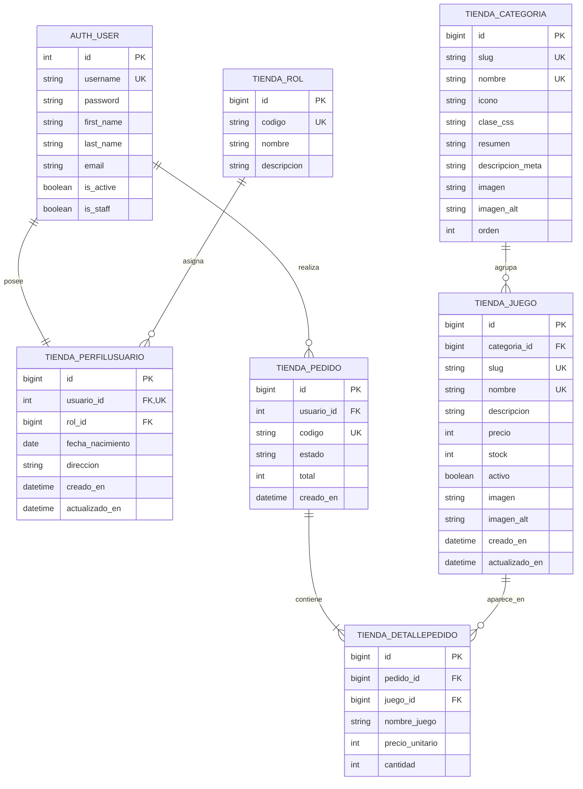

# Modelo entidad relación normalizado de FreeGames

El modelo separa autenticación, perfiles, roles, catálogo y pedidos. `AUTH_USER` pertenece al sistema de autenticación de Django; las otras seis tablas corresponden a la aplicación `tienda`.

## Normalización

- **Primera forma normal:** cada campo guarda un valor atómico y cada tabla dispone de una clave primaria.
- **Segunda forma normal:** los atributos dependen de la clave completa. En `TIENDA_DETALLEPEDIDO`, la combinación pedido y juego es única.
- **Tercera forma normal:** roles, categorías, usuarios, juegos y pedidos se almacenan por separado. Los datos descriptivos no se repiten entre entidades relacionadas.

`NOMBRE_JUEGO` y `PRECIO_UNITARIO` se conservan en el detalle como una instantánea deliberada de la compra. Así, el historial no cambia si posteriormente se modifica el juego.
